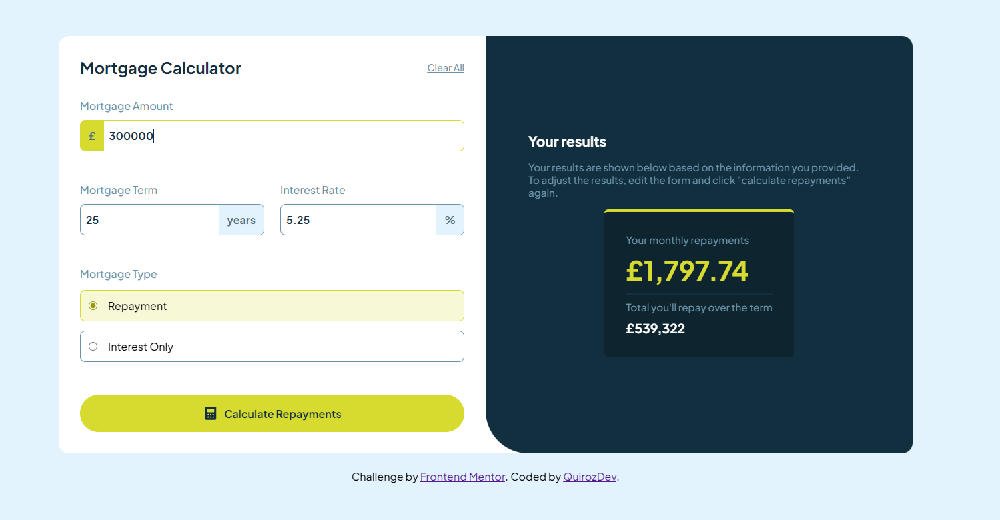

# Frontend Mentor - Mortgage repayment calculator

This is a solution to the <a href="https://www.frontendmentor.io/challenges/mortgage-repayment-calculator-Galx1LXK73" target="_blank">Mortgage repayment calculator challenge on Frontend Mentor</a>. Frontend Mentor challenges help you improve your coding skills by building realistic projects.

<a href="https://quirozdev.github.io/MortgagePaymentCalculator/" target="_blank">Live Site Demo</a>

## Table of contents

- [Overview](#overview)
  - [The challenge](#the-challenge)
  - [Screenshot](#screenshot)
  - [Links](#links)
- [My process](#my-process)
  - [Built with](#built-with)
- [Author](#author)

## Overview

### The challenge

Users should be able to:

- Input mortgage information and see monthly repayment and total repayment amounts after submitting the form
- See form validation messages if any field is incomplete
- Complete the form only using their keyboard
- View the optimal layout for the interface depending on their device's screen size
- See hover and focus states for all interactive elements on the page

### Screenshot

### Links

- <a href="https://github.com/Quirozdev/MortgagePaymentCalculator" target="_blank">Solution URL</a>
- <a href="https://quirozdev.github.io/MortgagePaymentCalculator/" target="_blank">Live Site URL</a>

### Built with

- Vue 3 with the Composition API
- Semantic HTML5 markup
- CSS custom properties
- Flexbox
- Responsive design

## Author

- GitHub - <a href="https://github.com/Quirozdev" target="_blank">Quirozdev</a>
